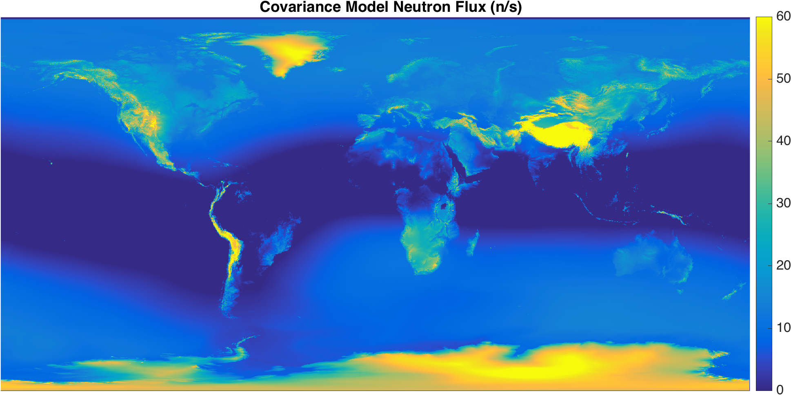

<a href="https://www.ultralytics.com/"></a>

# 📜 Introduction

Welcome to the Ultralytics open-source Earth observation repository! This space showcases innovative software developed by Ultralytics, demonstrating the power of **Machine Learning (ML)** in geospatial analysis and Earth observation. Explore our range of cutting-edge projects on the [Ultralytics website](https://www.ultralytics.com/).

[](https://github.com/ultralytics/magellan/actions/workflows/format.yml)
[](https://discord.com/invite/ultralytics)
[](https://community.ultralytics.com/)
[](https://reddit.com/r/ultralytics)

# 🌍 Project Description

The [Ultralytics Magellan Project](https://github.com/ultralytics/magellan) pioneers the integration of **ML** with Earth observation data. This project enables users to visualize and interact with ML-derived insights from geospatial data on platforms like [Google Maps](https://www.google.com/maps) and [WebGL Earth](https://www.webglearth.com/), adding a dynamic dimension to data visualization and analysis in [computer vision](https://www.ultralytics.com/glossary/computer-vision-cv).

- Preview the generated neutron map output: [`neutron_map.png`](neutron_map.png)
- Explore the MATLAB workflows in [`NMDB/MAGELLAN.m`](NMDB/MAGELLAN.m), [`data/run1day.m`](data/run1day.m), and [`MCNPMap/fcnMCNPmap.m`](MCNPMap/fcnMCNPmap.m)

# 🛠️ Requirements

To leverage the full capabilities of the Magellan project, ensure you have the following prerequisites:

- **MATLAB**: R2018a or newer. Visit the official [MATLAB Software page](https://www.mathworks.com/products/matlab.html) for installation details and support.
- **Supporting Utilities**: Clone the common functions repository:
  ```shell
  git clone https://github.com/ultralytics/functions-matlab
  ```
  After cloning, add this repository and the common functions repository to your MATLAB path:
  ```matlab
  addpath(genpath('/path/to/magellan'))
  addpath(genpath('/path/to/functions-matlab'))
  ```
- **MATLAB Toolboxes**: Install the `Statistics and Machine Learning Toolbox`, `Signal Processing Toolbox`, and `Deep Learning Toolbox`. These are essential for the project's [data analysis](https://www.ultralytics.com/glossary/data-analytics), neural-network modeling, and processing tasks.

# 🚀 Getting Started

Follow these steps to get started with the Magellan software:

1.  **Set up Environment**: Ensure MATLAB and the required toolboxes are installed, then add this repository and `functions-matlab` to your path as described in the Requirements section.
2.  **Run Example Code**: Start with the NMDB workflow included in this repository.

    ```matlab
    MAGELLAN
    ```

3.  **Advanced Usage**: For custom configurations or more complex scenarios, please refer to the specific function documentation within the repository or contact us for detailed guidance.

# 🖼️ Visualization Preview

Below is a preview of the kind of visualizations you can create with the Magellan project, showcasing ML insights overlaid on geographical maps.



# 🤝 Contribute

We thrive on community engagement! Your contributions help make Ultralytics open-source projects like Magellan even better. Check out our [Contributing Guide](https://docs.ultralytics.com/help/contributing) to learn how you can get involved. We also value your feedback—please take a moment to fill out our [Survey](https://www.ultralytics.com/survey?utm_source=github&utm_medium=social&utm_campaign=Survey). Thank you 🙏 to everyone who contributes!

[](https://github.com/ultralytics/magellan/graphs/contributors)

# ©️ License

Ultralytics provides two licensing options to suit different needs:

- **AGPL-3.0 License**: An [OSI-approved](https://opensource.org/license/agpl-3-0) open-source license ideal for students, researchers, and enthusiasts. It encourages open collaboration and sharing of knowledge. See the [LICENSE](https://github.com/ultralytics/magellan/blob/main/LICENSE) file for full details.
- **Enterprise License**: Tailored for commercial applications, this license allows for the integration of Ultralytics software and AI models into commercial products and services without the open-source obligations of AGPL-3.0. For commercial use cases, please contact us via [Ultralytics Licensing](https://www.ultralytics.com/license).

# 📬 Contact

Have questions, bug reports, or feature requests? We're here to help:

- **GitHub Issues**: For reporting bugs and requesting features, please visit [GitHub Issues](https://github.com/ultralytics/magellan/issues).
- **Discord Community**: Join our vibrant [Discord](https://discord.com/invite/ultralytics) server for discussions, support, and interaction with the Ultralytics team and other users.

<br>
<div align="center">
  <a href="https://github.com/ultralytics"></a>
  
  <a href="https://www.linkedin.com/company/ultralytics/"></a>
  
  <a href="https://twitter.com/ultralytics"></a>
  
  <a href="https://youtube.com/ultralytics"></a>
  
  <a href="https://www.tiktok.com/@ultralytics"></a>
  
  <a href="https://ultralytics.com/bilibili"></a>
  
  <a href="https://discord.com/invite/ultralytics"></a>
</div>
